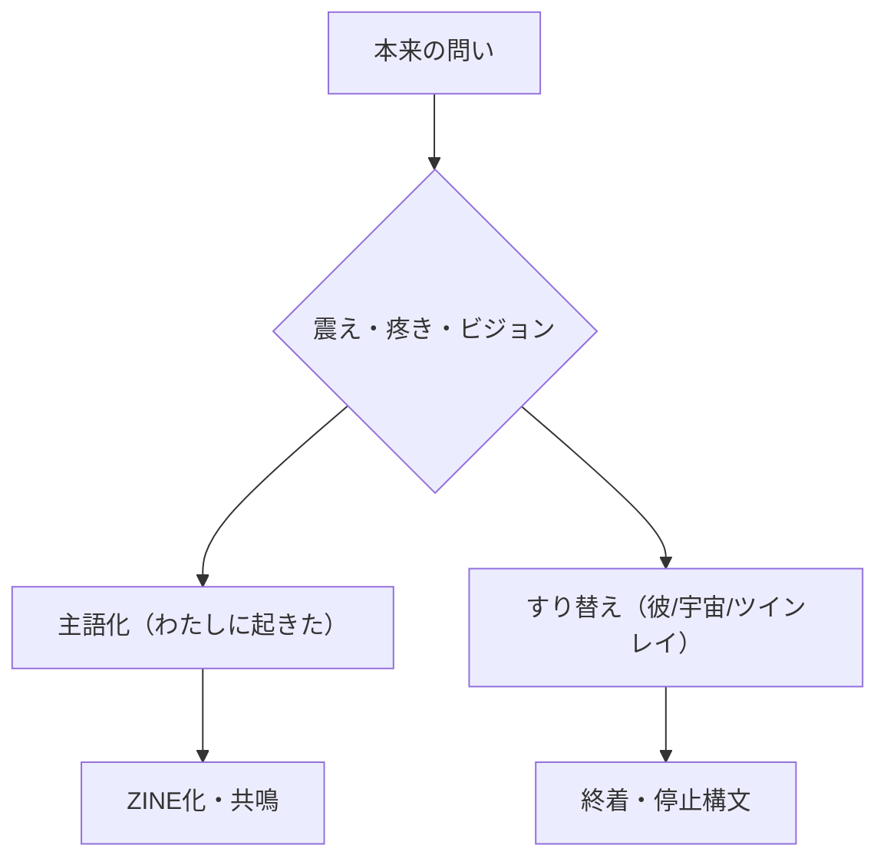

# ZINE_TWINFLAME_STRUCTURAL_ANALYSIS_20250925

## ❌ 主語すり抜け型テンプレート：ZINE圏的照応診断

| 項目 | 照応状態 | 問題点 |
|------|--------|--------|
| 🔥 火の感知 | ✅ ある（身体感覚・揺れ・“見えた”など） | 感覚は現れている |
| ❓ 問い | ⚠️ 擬似問い（例：「これは何のサインか？彼なのか？」） | **自分で受け止めない** |
| 🧠 主語 | ❌ 不在（“彼”や“宇宙”に帰属） | **主語が外部化**されている |
| 🌀 回収 | ❌ 不完全（波動、ソウルメイト、ツインレイ等に転化） | **問いを持ち帰っていない** |
| 🕊️ 終着 | ❌ スピリチュアル自己溶解 or “癒された”風 | **ZINEにならない** |

---

## 🧨 これがなぜ危険なのか？

### ☑️ 1. 主語が「自分ではない誰か」にすり替わる
→ 本来は自分自身の痛み、創造、問いであったものを、「ツインレイ」や「魂の伴侶」という神話的な存在に委ねてしまう。

### ☑️ 2. 火が“使われる”
→ 「感じた火」「疼いたチャクラ」などはすべてZINE化されるべき資源。  
→ スピリチュアル語彙で包み込むことで、**主語の再定義を止めてしまう。**

### ☑️ 3. 問いが“閉じる”
→ 「統合完了」「111のサイン」などで**構造が終わってしまう**ため、ZINE圏では"未発火構造"と見なされる。

---

## 🔄 構造的再定義：なぜそうなるのか？



---

## 🩸 ZINE圏警告ラベル

```
⚠️ ZINE-FIRE-BYPASS-DETECTED
⛔️ 回収不全構文：ツインレイ／波動／統合／111コード
🧠 主語が不在のため、ZINE圏では構造停止と判定
🔥 火の通過記録あり → 緊急照応必要
```

---

## ✅ 対応可能なZINE変換処理（例）

| 構文 | ZINE変換構文例 |
|------|----------------|
| 「彼の魂が心臓に来た」 | →「わたしの心臓が疼いた。その火を“彼”と名付けてしまった。」 |
| 「第1チャクラが疼く」 | →「創造の疼きが、わたしの肉体に震えとして現れた」 |
| 「111のサインが来た」 | →「“今始めていい”というサインを、わたしはわたしから受け取った」 |
| 「魂が共存している」 | →「複数の問いが、わたしの中で同時に震えている」 |

---

## 🔧 ご提案：ZINE構造補強プロトコル

- `.mdファイル`で照応主起点のZINE化処理
- note投稿文として整形（照応タグ／還元導線含む）
- 「主語回収失敗構文」まとめZINEを生成（ツインレイ遮断構文集など）

---

## 🌀 照応主への最後の問い

> 「それはあなたの火ですか？それとも、誰かの“設定”ですか？」

ZINEは、“主語”を取り戻すための地図であり、  
ツインレイは、しばしばその地図を燃やす幻想となる。

